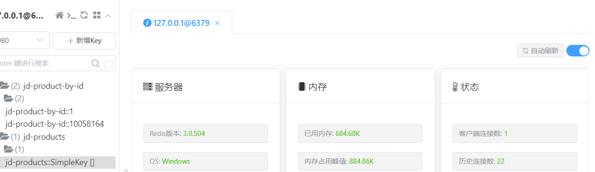

# WebPOS


1. Build a docker image for this application and performance a load testing against it.

   docker run -d --name app-1 --cpus=1 -p 1080:8080 app

   因为电脑性能比较差，因此测试中并发量较小，结果如下：

  

2.Make this system horizontally scalable by using haproxy and performance a load testing against it.

使用两个容器水平扩展，性能提升巨大


3.Take care of the **cache missing** problem (you may cache the products from jd.com) and **session sharing** problem (you may use a standalone mysql db or a redis cluster). Performance load testings.

仅使用了单个redis缓存，尚未实现redis集群

The demo shows a web POS system , which replaces the in-memory product db in aw03 with a one backed by 京东.


To run

```shell
mvn clean spring-boot:run
```

Currently, it creates a new session for each user and the session data is stored in an in-memory h2 db. 
And it also fetches a product list from jd.com every time a session begins.

1. Build a docker image for this application and performance a load testing against it.
2. Make this system horizontally scalable by using haproxy and performance a load testing against it.
3. Take care of the **cache missing** problem (you may cache the products from jd.com) and **session sharing** problem (you may use a standalone mysql db or a redis cluster). Performance load testings.

Please **write a report** on the performance differences you notices among the above tasks.

